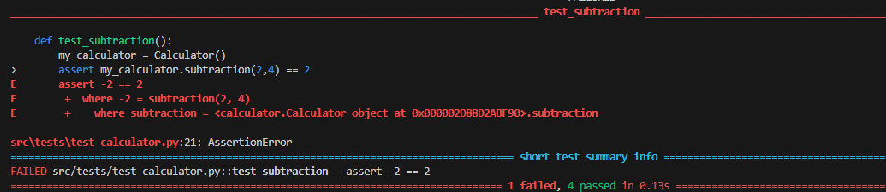
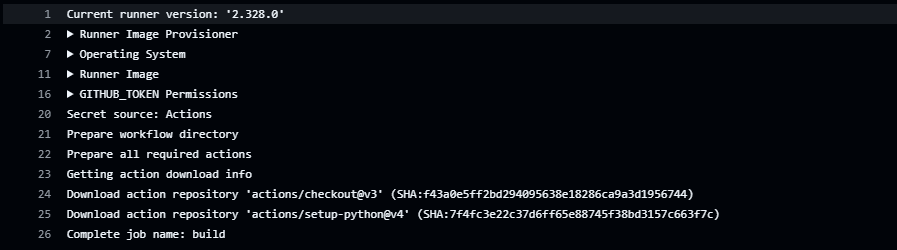
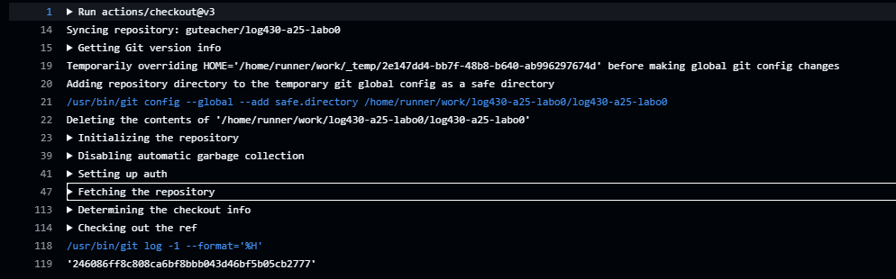

# Rapport de laboratoire

**Nom :** William

## Question 1

Il nous retourne le fichier qui contient le test echouter ainsi que la ligne du test 

## Question 2
GitHub Actions prépare le runner, télécharge les actions nécessaires, configure Python et le dépôt, et est prêt à lancer le job.

Cette action copie ton code depuis GitHub vers l’environnement du runner pour que le workflow puisse l’utiliser.

## Question 3

_Réponse à la question 3 ici._

---